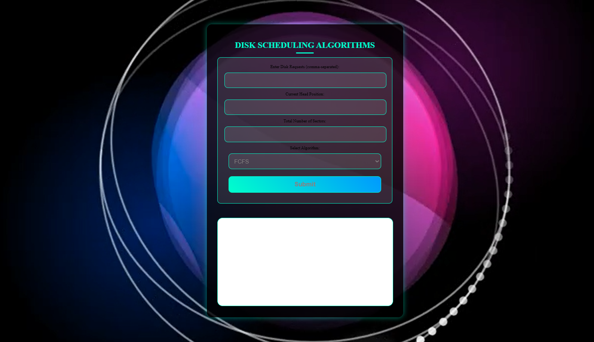
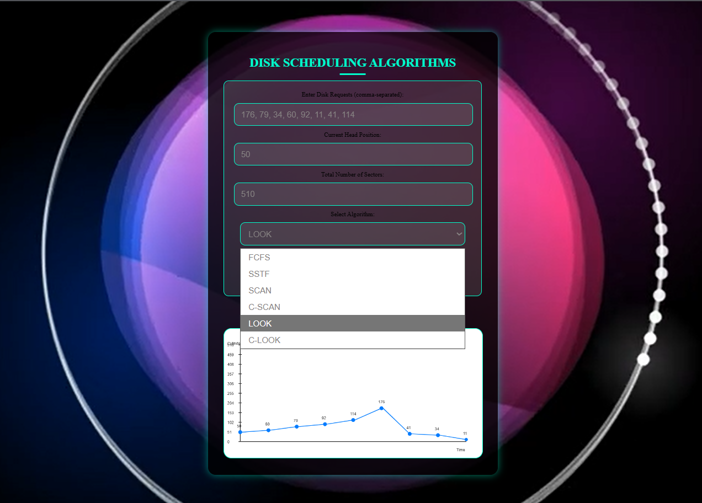
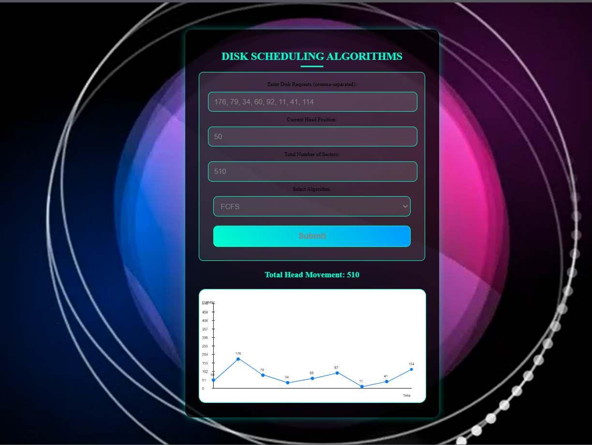

# Disk Scheduling Algorithms Visualization

## 📌 Operating System Mini Project

This project visualizes various Disk Scheduling Algorithms used in Operating Systems.
It helps understand head movement, seek time, and request servicing order using
interactive graphical visualization.

---

## 🚀 Algorithms Implemented
- FCFS (First Come First Serve)
- SSTF (Shortest Seek Time First)
- SCAN
- C-SCAN
- LOOK
- C-LOOK

---

## 🛠️ Technologies Used
- HTML
- CSS
- JavaScript
- Canvas API

---

## 📊 Features
- User input for disk requests and head position
- Calculates total head movement
- Real-time graphical visualization
- Animated background video
- Responsive design

---

## ▶️ How to Run
1. Download or clone the repository
2. Open `index.html` in a web browser
3. Enter disk requests and select an algorithm

---

## 👨‍🎓 Academic Use
This project is developed as part of an **Operating System Mini Project**.

---

## 📸 Screenshots

### Home Page

### Disk Algorithm Overview

### FCFS Algorithm

### C-SCAN Algorithm

### LOOK Algorithm

